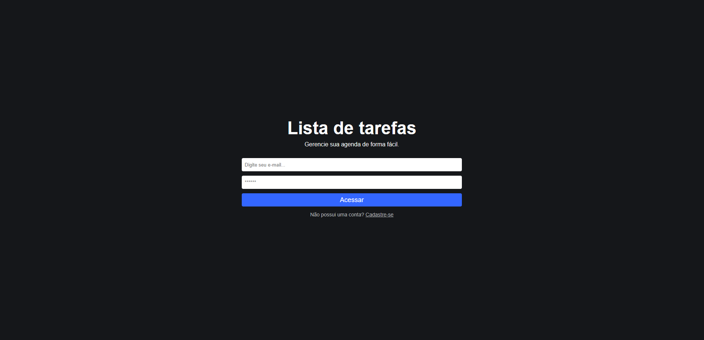
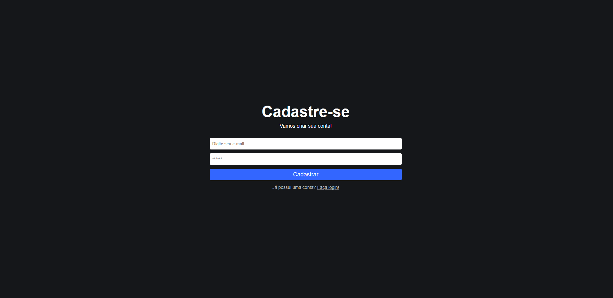
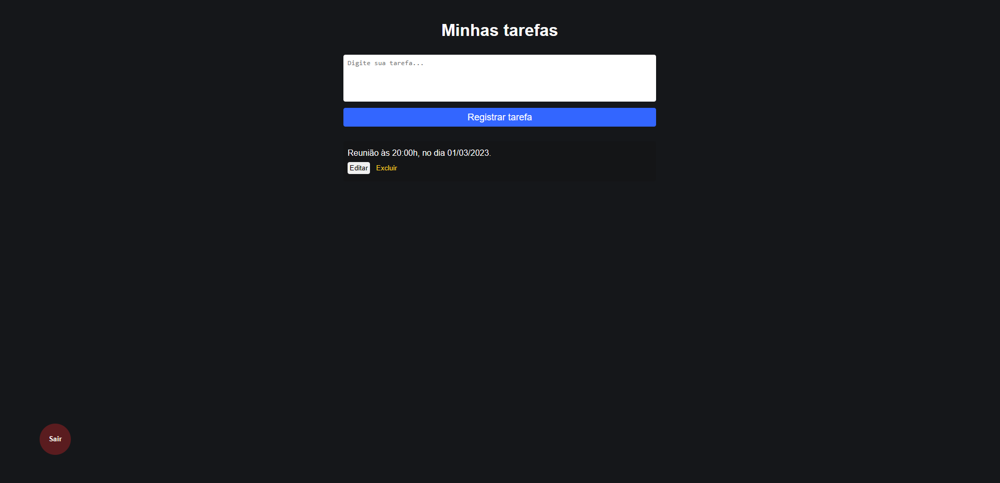

<h2 align="center">Lista de tarefas</h2> 

### 🔖 Sobre

---

O projeto **Lista de tarefas** é uma ferramenta que foi criada para gerar organização pessoal. Com ela, você pode **criar**, **editar** e **excluir** tarefas em aberto.  

### 🚀 Tecnologias utilizadas

---

O projeto foi desenvolvido utilizando as seguintes tecnologias

-   [React](https://pt-br.reactjs.org/)
-   [Firebase](https://firebase.google.com/?hl=pt)  

### 🖥️ Screens

---

Tela de login:
  
Tela de registro:
  
Tela de nova tarefa:
  

### 😎 Publicado no Netlify

---

  

### 🔽 Possui

---

-   ✅ Cadastro de usuário;
-   ✅ Login;
-   ✅ Criação, edição ou exclusão de tarefas.  

### 🤵 Autor

---

Desenvolvido com 💙 por Bruno Pereira.

